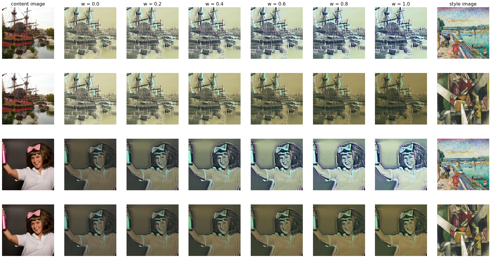

## Проект 5. Перенос стиля на мобильном устройстве

## Цель
#### Создать мобильное приложение, реализующее функцию переноса стиля.

  

## Этапы работы
* #### Подготовка наборов данных в формате tfrecord. Выбраны датасет Wiki-art для набора стилей и датасет Imagenet для контентных изображений.
* #### Обучение сети, работающей на мобильном устройстве (используя исследовательский проект Magenta).
* #### Перевод обученной модели tflite.
* #### Визуализация результатов обучения, в том числе с разной степенью стилизации (с помощью линейной интерполяции параметрами контента и параметрами стиля)

  

* #### С помощью Android Studio изменение источника загружаемых весов в мобильное приложение, разработанное TensorFlow.
* #### Сбор и запуск приложения.

## Источники данных
* #### [датасет Wiki-art](https://github.com/cs-chan/ArtGAN/tree/master/WikiArt%20Dataset)
* #### [датасет Imagenet](https://www.kaggle.com/datasets/hmendonca/imagenet-1k-tfrecords-ilsvrc2012-part-1)
* #### [контрольная точка VGG-16](http://download.tensorflow.org/models/vgg_16_2016_08_28.tar.gz)
* #### [контрольная точка MobileNet-2](https://storage.googleapis.com/mobilenet_v2/checkpoints/mobilenet_v2_1.0_224.tgz)
* #### [Magenta](https://github.com/magenta/magenta/tree/main/magenta/models/arbitrary_image_stylization)
* #### [TensorFlow Lite Style Transfer](https://github.com/tensorflow/examples/tree/master/lite/examples/style_transfer/android)
